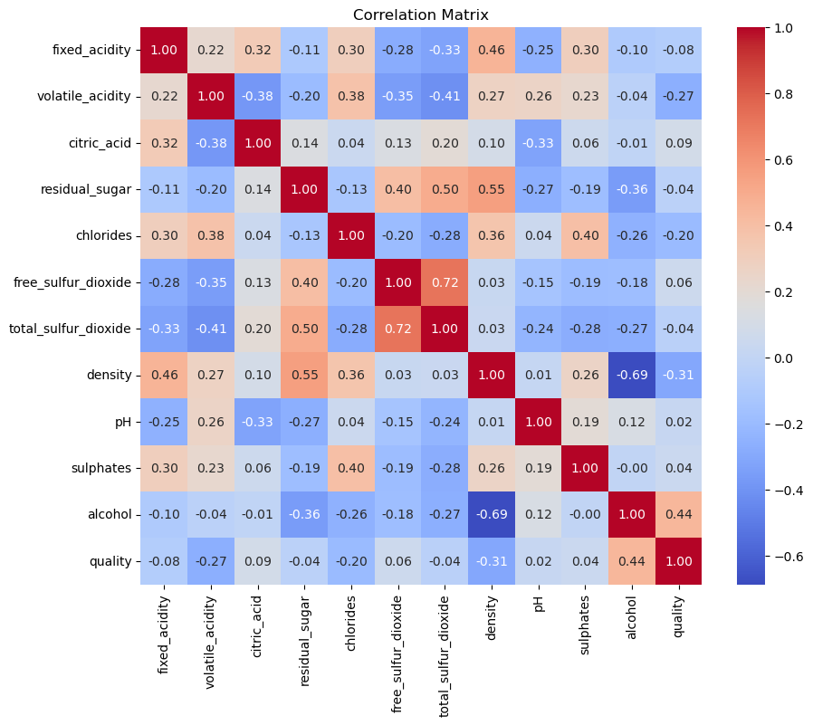
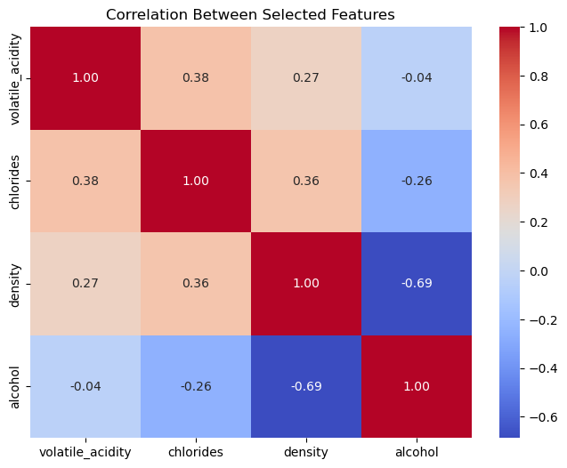
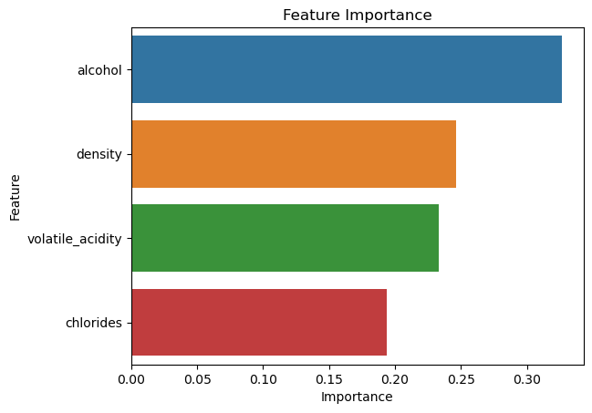
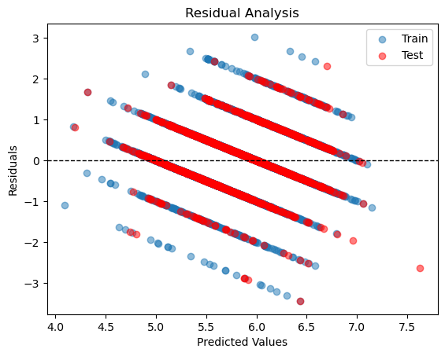
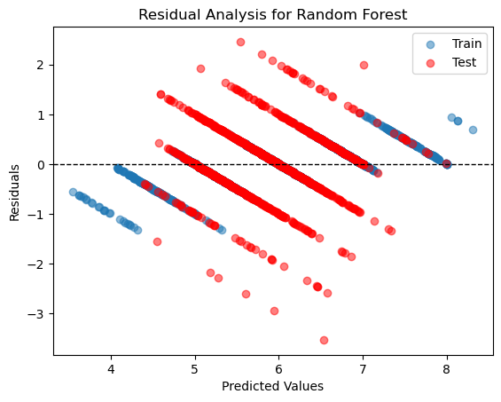
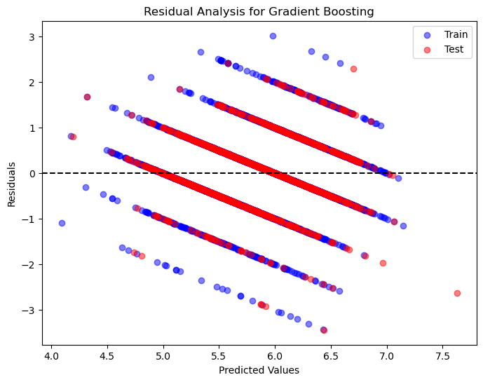
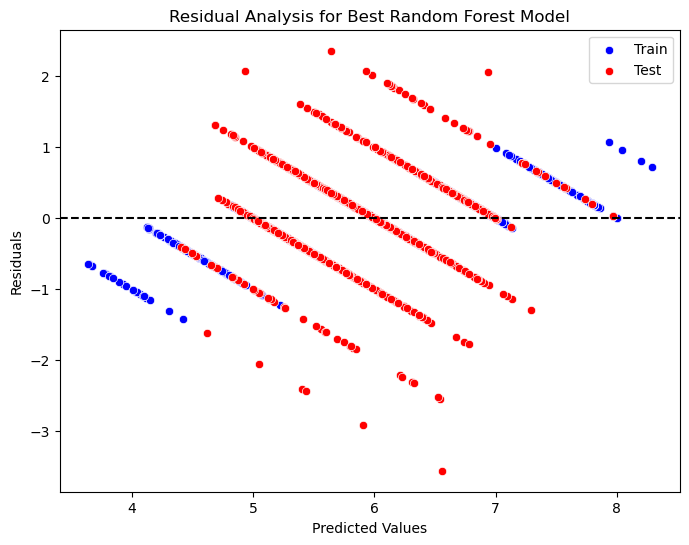

## Correlation Matrix

### Key Observations from the Correlation Matrix

#### Features with Stronger Positive Correlation to quality

- Alcohol (0.44): Strongest positive correlation with quality. Higher alcohol content is likely associated with better quality wines.
- Sulphates (0.04): Slight positive correlation. It may contribute marginally to higher quality.

#### Features with Stronger Negative Correlation to quality

- Volatile Acidity (-0.27): Negative correlation, suggesting higher acidity may lower quality.
- Density (-0.31): Denser wines tend to have lower quality, possibly linked to sugar or alcohol levels.

#### Weakly Correlated Features

- Features like chlorides, pH, and residual sugar show very weak or no significant correlation with quality.

#### Inter-Correlations Between Features

- Total Sulfur Dioxide and Free Sulfur Dioxide (0.72): Strong positive correlation. This indicates potential multicollinearity, which might need addressing during regression.

### Key observations from the Selected Feature Correlation Matrix

#### density vs. alcohol

- Correlation: -0.69 (moderate negative correlation).
- Suggests that higher alcohol content reduces the density of wine, as expected.

## Random Forest Feature Importance

### Insights

- Alcohol: Plays a major role in determining wine quality. Any model should focus on accurately modeling its relationship with quality.
- Density: Likely has a strong inverse relationship with alcohol content, as observed earlier. While important, we need to ensure that multicollinearity is addressed.
- Volatile Acidity: Contributes moderately; higher levels tend to lower quality.
- Chlorides: Least important but still a contributor to the model.

## Creating a Linear Regression Model

### Selected Features

- volatile_acidity
- chlorides
- density
- alcohol

## Results

- Training RMSE: 0.75
- Test RMSE: 0.74
- Training R²: 0.27
- Test R²: 0.25

## Observations

### Residual Plot

- The residuals show distinct patterns (e.g., clustering around certain predicted values).
- This suggests that the linear regression model may not fully capture the complexity of the relationships in the data.
  
### Metrics

- The RMSE values are small relative to the range of wine quality scores (1–10), indicating reasonable error magnitude.
- However, the low R² values suggest that the model explains only ~25% of the variance in wine quality.

## Creating a Non-Linear Regression Model

- Random Forest Training RMSE: 0.25
- Test RMSE: 0.66
- Random Forest Training R²: 0.92
- Test R²: 0.41

### Analysis of the Residual Plot

#### Residual Distribution

- Residuals (errors) are the differences between predicted and actual values. Ideally, they should be randomly distributed around the horizontal line at 0, showing no systematic bias.
- In your plot, the residuals show distinct bands corresponding to discrete quality levels. This is expected because the quality variable is ordinal and discrete (even though we’re treating it as continuous for regression).
  
#### Clustering Patterns

- The vertical bands along predicted values represent the model’s attempts to fit the discrete quality levels. Random Forest performs well with such data, which might explain why the training residuals cluster closely to 0.
- Test residuals appear slightly more scattered than training residuals, indicating slight overfitting.
  
#### Symmetry

- The residuals seem evenly distributed above and below the 0 line, suggesting no significant bias in predictions. This is a good sign.

#### Magnitude of Residuals

- The residuals are generally within ±3, which is reasonable considering the range of the target variable (quality). However, some test points show larger residuals compared to training, highlighting areas where the model struggles with generalization.

## Creating a Gradient Boosting Regression Model

- Gradient Boosting Training RMSE: 0.69
- Test RMSE: 0.72
- Gradient Boosting Training R²: 0.38
- Test R²: 0.29

### Training RMSE: 0.69 and Test RMSE: 0.72

- These indicate the model’s error in predicting wine quality. The test RMSE is slightly higher than the training RMSE, suggesting that the model generalizes reasonably well but could still be improved.

### Training R²: 0.38 and Test R²: 0.29

- These values indicate the proportion of variance in the wine quality ratings explained by the model. A Test R² of 0.29 suggests the model has limited predictive power and might not fully capture the relationships between features and quality.

### Residual Plot Insights

- The residuals are fairly scattered and centered around 0, which is a good sign. However, the spread of residuals for some predicted values suggests that the model might struggle with some specific predictions, likely due to the non-linearity or noise in the data.

## Hyperparameter Tuning for Random Forest

- Training RMSE: 0.24
- Training R²: 0.92
- Test RMSE: 0.65
- Test R²: 0.42

### Feature Importance

- As shown in the importance plot, “alcohol” remains the most critical predictor, followed by “density,” “volatile_acidity,” and “chlorides.” This aligns with domain expectations in wine quality prediction.

### Residual Analysis

- The residual plot demonstrates better prediction across different quality ranges, with fewer significant errors. However, there is still some clustering of residuals around certain predicted quality levels, likely reflecting the inherent discrete nature of the wine quality target.

### Test R² of 0.42

- While not extremely high, this R² suggests that the model captures 42% of the variability in wine quality, which is reasonable given the simplicity of the features and the likely subjectivity in the wine quality scoring.