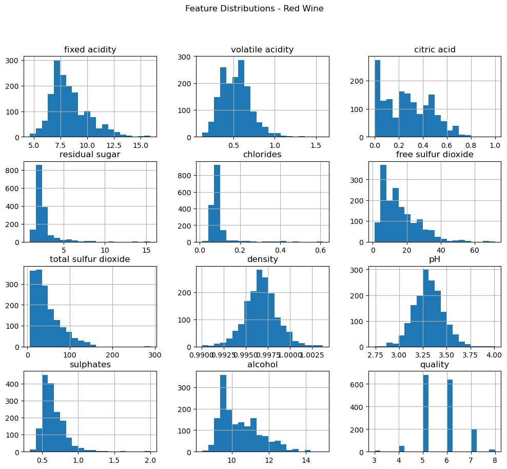
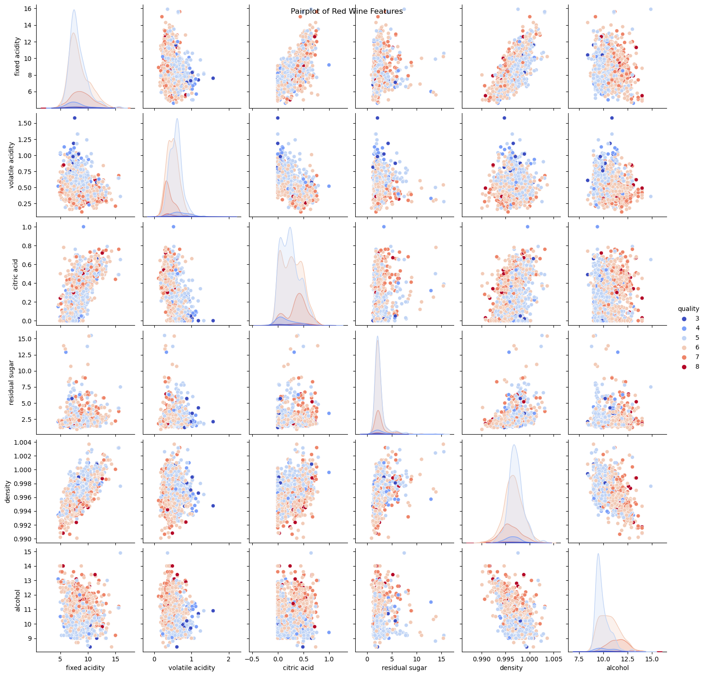
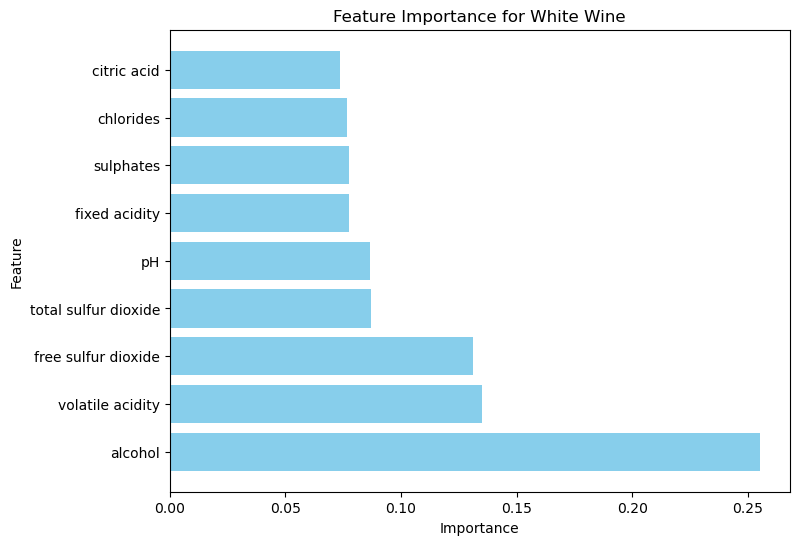
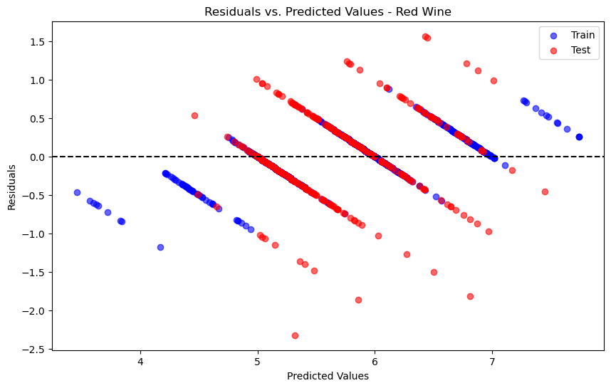

# Wine Quality Analysis

This Markdown document will serve as a comprehensive home base for the **Wine Quality Analysis** project. It includes an organized structure for observations, code snippets, visualizations, and key findings.

---

## Table of Contents

- [Wine Quality Analysis](#wine-quality-analysis)
  - [Table of Contents](#table-of-contents)
  - [1. Introduction](#1-introduction)
    - [Tools and Libraries](#tools-and-libraries)
  - [2. Objectives](#2-objectives)
  - [3. Dataset Overview](#3-dataset-overview)
    - [Source](#source)
    - [Description](#description)
    - [Structure](#structure)
  - [4. Exploratory Data Analysis (EDA)](#4-exploratory-data-analysis-eda)
    - [4.1 Understanding the data](#41-understanding-the-data)

---

## 1. Introduction

The **Wine Quality Dataset** contains data on physicochemical attributes of wines, such as acidity, chlorides, and alcohol content, along with a quality score rated by wine tasters. This analysis aims to explore the data, engineer meaningful features, and build predictive models to estimate wine quality. 

### Tools and Libraries

- **Programming Language**: Python
- **Libraries**: pandas, numpy, matplotlib, seaborn, scikit-learn, etc.

---

## 2. Objectives

1. Perform exploratory data analysis to understand the dataset.
2. Identify key features influencing wine quality.
3. Develop predictive regression models to estimate wine quality scores.
4. Conduct detailed error analysis to evaluate model performance.
5. Provide actionable insights and suggestions for further research.

---

## 3. Dataset Overview

### Source

The dataset was sourced from the UCI Machine Learning Repository. It is related to red and white variants of the Portuguese "Vinho Verde" wine.

### Description

- **Input Variables**: 11 physicochemical attributes (e.g., acidity, chlorides, alcohol).
- **Output Variable**: Quality score (integer between 3 and 9).

### Structure

| Feature               | Description                             | Type      | Range (red)  | Range (white) |
|-----------------------|-----------------------------------------|-----------|------------  |---------------|
| fixed_acidity         | Concentration of fixed acids            | Numeric   | 4.6 - 15.9   | 3.8 - 14.2    |
| volatile_acidity      | Concentration of volatile acids         | Numeric   | 0.120 - 1.58 | 0.08 - 1.100  |
| citric_acid           | Concentration of citric acid            | Numeric   | 0.00 - 1.00  | 0.00 - 1.66   |
| residual_sugar        | Residual sugar after fermentation       | Numeric   | 0.9 - 15.5   | 0.6 - 65.8    |
| chlorides             | Chloride concentration                  | Numeric   | 0.012 - 0.611| 0.009 - .350  |
| free_sulfur_dioxide   | Free SO2 concentration                  | Numeric   | 1 - 72       | 2 - 289       |
| total_sulfur_dioxide  | Total SO2 concentration                 | Numeric   | 6- 289       | 9 - 440       |
| density               | Density of the wine                     | Numeric   | 0.990 - 1.000| 0.987 - 1.040 |
| pH                    | Acidity (pH scale)                      | Numeric   | 2.74 - 4.01  | 2.72 - 3.2    |
| sulphates             | Sulphate concentration                  | Numeric   | 0.33 - 2.00  | 0.22 - 1.08   |
| alcohol               | Alcohol content                         | Numeric   | 8.4 - 14.9   | 8.0 - 14.2    |
| quality               | Quality score (target)                  |Categorical| 3 - 8        | 3 - 9         |

---

## 4. Exploratory Data Analysis (EDA)

### 4.1 Understanding the data - Feature Distributions

- **Alcohol Content**: Both red and white wines have a slight right skew in alcohol content. White wines tend to have a tiered distibution while reds have a more significant dropoff from about 9% alcohol content.
- **Residual Sugar**: White wines tend to have a much higher level of residual sugar.
- **Volatile Acidity**: Red wines tend to show higher levels of volatile acidity compared to white wines.
- **Citiric Acid**: White wines are normally distributed with a large frequency of wines near the mean. Red wines are right skewed with most of the wines showing lower levels of citric acid.
- **Density**: Density distributions are similar with the excpetion that white wines are packed tightly around 1.0.
- **Quality**: Both red and white wines are disributed normally around discrete scores of 5 or 6.

### 4.2 Understanding the data - Feature Pair Plots

- **Alcohol Content**: Higher levels of Alcohol seem to correlated with higher quality ratings in both red and white wines.
- **Density**: There is an inverse relationship between Alcohol content and density. Density also appears to have subtle trends with quality, especially for red wines.
- **Volatile Acidity**: Volitle Acidity appears to negatively impact wine quality, most notably in red wines.
- **Citric Acid**: Cittric acid may have a small positive relationship with wine quality, but it is more pronounced in the red wines.

### 4.3 Understanding the data - Correlation Matrix

1. Red Wine:
   1. Quality Correlations
      1. Alcohol = 0.48
      2. Volatile Acidity = -0.39
      3. Sulphates = 0.25
      4. Citric Acid = 0.23
   2. Feature Interrelations
      1. Density and Residual Sugar = 0.67
      2. Total Sulfur Dioxide and Free Sulfur Dioxide = 0.67
2. White Wine:
   1. Quality Correlations
      1. Alcohol = 0.44
      2. Density = -0.31
      3. Chlorides = -0.21
      4. Volatile Acidity = -0.19
   2. Feature Interrelations
      1. Density and Residual Sugar = 0.84
      2. Total Sulfur Dioxide and Free Sulfur Dioxide = 0.62
      3. Density and Alcohol = -0.78

## 5. Regression Analysis

### 5.1 Full Feature Analysis

1. Red Wine - Model Performance:
   1. Training RMSE: 0.22, Test_RMSE: 0.55
   2. Training R^2: 0.93, Test R^2: 0.54
2. White Wine - Model Performance:
   1. Training RMSE: 0.23, Test_RMSE: 0.59
   2. Training R^2: 0.93, Test R^2: 0.55
3. Feature Importance Plot - Red Wine:
   1. 
4. Feature Importance Plot - White Wine:
   1. 

### 5.2 Removing Features

#### 5.2.1 Features Removed Due To Highly Correlated Pairs (Threshold > 0.65):

##### Red Wine

   1. Free sulfur dioxide
   2. fixed acidity

##### White Wine

   1. density
   2. residual sugar

##### Results

1. Red Wine - Model Performance:
   1. Training RMSE: 0.22, Test_RMSE: 0.56
   2. Training R^2: 0.93, Test R^2: 0.53
2. White Wine - Model Performance:
   1. Training RMSE: 0.23, Test_RMSE: 0.59
   2. Training R^2: 0.93, Test R^2: 0.55
3. Feature Importance Plot - Red Wine:
   
4. Feature Importance Plot - White Wine:
   

##### Observations

- After reducing and testing numerous feature sets, I have concluded that my best model performance has been with removing highly correlated pairs. The model performance dropped with each feature reduction after interrealated pair removals. I will evaluate and tune this model to try and improve performance.

### 5.3 Error Analysis

#### 5.3.1 Residual Distributions

1. Red Wine:
    
    
2. White Wine:
    
    

#### 5.3.1 Observations

1. Residuals
   1. The distributions are centered around zero.
   2. The tails are longer in the test residuals which may require some examination.
2. Residuals Vs. Predicted Values
   1. The residuals are spread randomly around zero.
   2. The spread in the test set appears to increase at higher predicted
